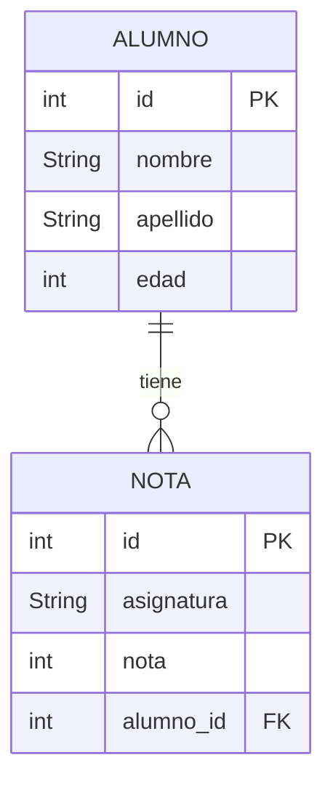

# Programa de Gestión de Instituto - Acceso a Datos RA3

## Descripción general

Este programa implementa un sistema de gestión de alumnos y sus notas en un instituto. Permite:

- Crear tablas de alumnos y notas.
- Insertar, actualizar y borrar alumnos.
- Insertar, actualizar y borrar notas asociadas a alumnos.
- Listar alumnos y sus notas.
- Consultar alumnos por edad.

El programa soporta tres modos de funcionamiento:

1. **MOCK:** Datos en memoria para pruebas rápidas.
2. **SQLite:** Base de datos local en archivo.
3. **Oracle XE:** Base de datos Oracle remota.

Se utiliza una interfaz gráfica sencilla basada en `JOptionPane` para la interacción con el usuario.
Se propone realizarla con `JavaFX` en el futuro.

---

## Problemas encontrados

Durante el desarrollo surgieron varios problemas importantes:

1. **Gestión de IDs en modo MOCK:**  
   Inicialmente, los IDs de alumnos y notas se asignaban de forma estática o mediante cast de DAO, lo que provocaba errores de tipo (`ClassCastException`) al cambiar de modo MOCK a base de datos real.

2. **Inconsistencia de ID de notas:**  
   Al agregar nuevas notas, los IDs empezaban en números inesperados (como 2 o 3), porque se contaban elementos de listas distintas o se usaban streams de manera inconsistente.

3. **Dependencia del `Connection` en MOCK:**  
   Muchos métodos dependían de la conexión para comprobar la existencia de alumnos o generar IDs, lo que no era necesario en el modo MOCK y generaba excepciones.

---

## Solución implementada con ayuda de IA

Para resolver estos problemas se aplicaron las siguientes estrategias:

- **Uso de un método `getNextId` unificado:**  
  Este método calcula el próximo ID de manera segura tanto para MOCK como para bases de datos reales, evitando cast innecesarios y asegurando IDs consecutivos.

- **Extensión de la interfaz `InstitutoDAO`:**  
  Se añadió el método `listarNotas()` para que `getNextId` pueda obtener los IDs de notas sin depender de la implementación concreta de MOCK.

- **Separación clara de lógica para MOCK y DB real:**  
  Cada operación (insertar, actualizar, borrar) ahora maneja por separado la lógica de MOCK y la lógica de base de datos, evitando excepciones por uso de `Connection` nulo.

Estas mejoras fueron sugeridas y refinadas con la ayuda de IA, que permitió identificar los patrones problemáticos y proponer una arquitectura más segura y limpia.

---

## Esquema de las entidades/tablas

- **ALUMNO**: Tabla que almacena información básica de cada alumno.

- **NOTA**: Tabla que almacena las notas de cada alumno, vinculadas mediante alumno_id.

- La relación es **uno a muchos**: un alumno puede tener varias notas.

---

## Patrón DAO y Fábrica:
Se utiliza la interfaz `InstitutoDAO` y la clase `InstitutoDAOFactory` para abstraer la fuente de datos (MOCK, SQLite, Oracle). Esto permite cambiar la base de datos sin modificar la lógica del menú.

**Validación de datos:**

- Las notas solo pueden ser enteros entre 0 y 10.

- Se comprueba la existencia del alumno antes de insertar o actualizar una nota.

- Se evita el uso de IDs duplicados en modo MOCK.

**Uso de streams y programación funcional:**
- Para calcular el próximo ID, filtrar alumnos y notas, y generar listados de manera concisa y segura.

**Menús dinámicos con `JOptionPane`:**
La interacción con el usuario es guiada por menús que muestran opciones y listados actualizados en cada operación.

**Futuras mejoras:**

- Migrar la interfaz a JavaFX para mejorar la experiencia de usuario.

- Implementar un sistema de persistencia más robusto para MOCK usando serialización o archivos JSON/XML.

- Mejorar la visualización de listados y la búsqueda avanzada de alumnos y notas.